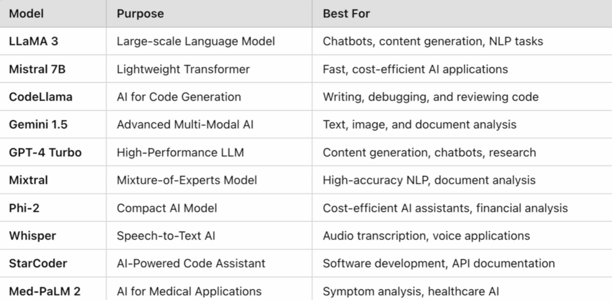

# Full-Stack AI with Ollama: Build and Deploy Real-World AI Applications

Learn how to build, deploy, and integrate cutting-edge AI models into production-ready web applications using Ollama and top open-source LLMs.

## What You’ll Learn

- **Local AI Deployment**: Install, configure, and run LLaMA 3, DeepSeek, Mistral, Mixtral, QwQ, Phi-2, MedLlama2, Granite3.2, and CodeLlama with Ollama.
- **AI-Powered Applications**: Develop real-world projects like AI news summarizers, proofreading tools, chatbots, and business automation assistants.
- **NLP & Automation**: Perform text summarization, document analysis, sentiment analysis, and intelligent task automation.
- **Code Generation & Debugging**: Auto-generate, complete, and debug code with CodeLlama.
- **Full-Stack Development**: Create FastAPI backends with AI integration and build interactive web UIs.
- **Real-Time Data Processing**: Fetch live data from news, finance, and other APIs for real-time AI insights.
- **Model Optimization**: Fine-tune prompts and improve AI response quality.

**State of the Art Models in Ollama**:

## Projects in the Repo:

- AI News Summarizer
- AI Proofreading Tool
- Customer Support Chatbot
- AI Financial Report Analyzer
- AI Job Application Screener
- AI Productivity Tools (email automation, meeting summarization)

## Requirements

- Basic Python knowledge (helpful but not mandatory)
- Basic understanding of AI & ML concepts
- (Optional) Familiarity with HTML, JavaScript, FastAPI

## Technologies Used

- Python
- FastAPI
- Ollama
- REST APIs
- Web Development (Frontend basics)

---

Take your AI skills from beginner to expert by building full-stack AI applications with the latest models and frameworks!
